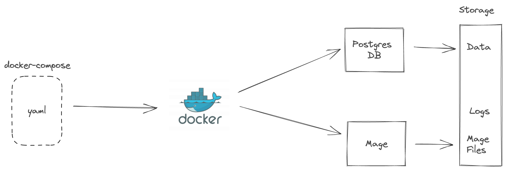

<div align="center">
    <h1>Mage AI Demo</h1>
</div>

<br />

<p align="center">
  
</p>


#### Table of contents
1. [What is this repo about?](#what-is-this-repo-about)
2. [How to run this code](#how-to-run-this-code)
3. [Improvements and other ideas?](#improvements-and-other-ideas)


## What is this repo about?
This repository shows how test [Mage](mage.ai).


## How to run this code

Pre-requisite is to have Docker and Docker Compose installed on the laptop. Follow below steps:


1. Run below command which will start a local postgres db, and Mage.
    ```
    $ make start
    ```


2. Open `http://localhost:6789` in browser and check pipelines, triggers etc ...
3. More guidelines will follow ...
4. ...
5. Run below command to do tear-down.
    ```
    $ make stop
    ```

## Improvements and other ideas

1. Only tested Piplines (Integration, Batch) and Triggers.
2. More testing of other functionalities
3. Test dbt with Mage
3. CI/CD and deployment in Kubernetes
4. ....